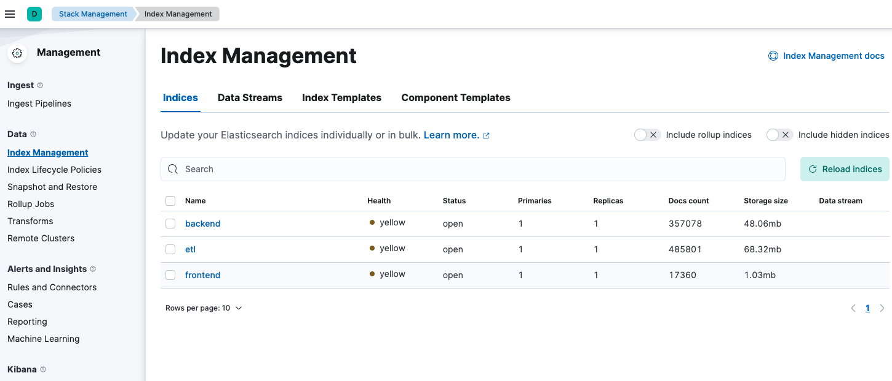

# System Golf

Prerequisites

- 2-Tier: https://github.com/jvalentino/sys-alpha-bravo
- 2-Tier with Load Balancing: https://github.com/jvalentino/sys-charlie
- 2-Tier with Load Balancing and Database Clustering: https://github.com/jvalentino/sys-delta
- 3-Tier: https://github.com/jvalentino/sys-echo-rest
- 3-Tier with Data Warehousing: https://github.com/jvalentino/sys-foxtrot

This is an example system that it used to demonstrate different architectural approaches as they relate to scalability. Its core functions are the following:

- The system shall allow a user to add documents
- The system shall version documents
- The system shall allow a user to download a document

This specific implementation takes our existing system, and moves it to the cloud on containerization:

- The front-end has been broken into its own independent application is separately load balanced.
- The backend is load balancer
- The database is clustered (assumed external)
- There is a separate database cluster that functions as long-term storage (assumed external)
- There is an additional backend that is used for handling managing the data warehouse
- **Everything is running on the cloud using both a containerization and externalization (SaaS) strategy**

System Components

- Architecture/Environment: https://github.com/jvalentino/sys-golf
- REST: https://github.com/jvalentino/sys-golf-rest
- ETL: https://github.com/jvalentino/sys-golf-etl
- Frontend: https://github.com/jvalentino/sys-golf-ui

# Table of Contents

- [Previous System](#previous-system)
- [Current System](#current-system)
- [Architecture](#architecture)
  * [Key Concepts and Technologies](#key-concepts-and-technologies)
  * [Production](#production)
    + [Source Control (Git)](#source-control-git)
    + [CI/CD](#cicd)
    + [Image Registry](#image-registry)
    + [Kubernetes](#kubernetes)
    + [More SaaS](#more-saas)
  * [Local (Demonstration)](#local-demonstration)
    + [Running it](#running-it)
      - [(1) Start minikube](#1-start-minikube)
      - [(2) Launch the Kubernetes Dashboard](#2-launch-the-kubernetes-dashboard)
      - [(3) Build it all](#3-build-it-all)
      - [(4) Start Everything](#4-start-everything)
      - [(5) Seed Data](#5-seed-data)
      - [(6) Login](#6-login)
    + [Primary Database (pg-primary)](#primary-database-pg-primary)
    + [Secondary Database (pg-secondary)](#secondary-database-pg-secondary)
    + [Elasticsearch](#elasticsearch)
    + [Kibana](#kibana)
    + [Backend](#backend)
    + [ETL](#etl)
    + [Frontend](#frontend)
    + [Prometheus](#prometheus)

# Previous System

**Data warehousing (Rating: a thousand consistently)**

A common problem that systems eventually run into given enough time, is that the more data stored in their system, the slower the systems perform. This is basically Relational Databases are not infinitely horizontally scalable. This had lead to what we call data warehousing. This is where the core system generally only contains data relevant to some time window (in years) relative to current, and a specialized database cluster is created for the purpose of historial inquiry. This is also the "big data" problem, which has its own solutions, but it is important to understand where it started.

[](https://github.com/jvalentino/clothes-closet-wiki/blob/main/wiki/step-6.png)

Pros

- Backend and Database independent, allowing us have different optimized servers.
- Multple backends allows us to handle more load from users.
- A database cluster removes the database from being the solo bottlekneck.
- Session is maintained in the database, taking it out of memory.
- Separation between backend and frontend allows for slightly more load.
- Data is continually and selectively pruned from the system to mitigate sizing issues.

Cons

- Incentivizes a snowflake architecture by having to fine tune the server hardware differently.
- You are paying for that second instance even when you don't need it.
- The addition of database land tripled the budget in hardware costs.
- You had to double your budget again by adding a data warehouse.
- Usage of the data warehouse required specialized tools and knowledge.
- Core reliance on RDMS limits upper scalability.

# Current System

**SaaS (Rating: 10k)**

Use software as a service (SaaS) nearly all the time when available. This is because it significantly reduces your complexity and overhead. For example, you no longer need to be a X-Whatever-Database Clustering Expert, you just use it as a service from your cloud platform. However, where you might have been able to get away having devs logging into 20 or so servers to pull logs and gather metrics, that is no longer an option in this environment. That is because everything is dynamic, meaning it can go away if not in use. This forces you to have to being in:

- Monitoring - To know the health of everything
- Alerting - To know when human intervention is required
- Centralized Logging - To get to the logs in once place

[](https://github.com/jvalentino/clothes-closet-wiki/blob/main/wiki/step-8.png)

Pros

- Backend and Database independent, allowing us have different optimized servers.
- Multple backends allows us to handle more load from users.
- A database cluster removes the database from being the solo bottlekneck.
- Session is maintained in the database, taking it out of memory.
- Separation between backend and frontend allows for slightly more load.
- Data is continually and selectively pruned from the system to mitigate sizing issues.
- Running the applications architecures on an elastic container platform allows them to scale up and down as needed.
- Using database as a service removed the need to deal with the details yourself.

Cons

- Core reliance on RDMS limits upper scalability.

# Architecture

## Key Concepts and Technologies

- Cloud Provider
- SaaS
- PaaS
- Image Registry
- Containerization
- Kubernetes
- Helm
- Docker
- Monitoring & Alerting
- Centralized Logging

## Production

With a now core reliance on Cloud with a focus on SaaS, the Production implementation is going to look a little different (with respect to Dev/Prod Parity) than our Development environments. This is largely do to that we get to a point where one can't run the entire system locally anymore due to its size, and thus work on a system in parts. Specifically, you don't expect the average developer to be running the entire monitoring stack locally, however someone working on the monitoring stack would need to. 

Consider that that when it comes to infrastructure like monitoring, logging, alerting, and data storage, the first rule of the cloud is "don't". More specifically, don't get in the business of hosting this stuff yourself, and instead rely on what your cloud provider has as SaaS. This is a tradeoff between cost and maintenance, being that implementing and maintain these infrastructures can be incredibly complicated, and generally require teams unto themselves. 

The resulting production architecture look like this:


### Source Control (Git)

The basis of any system is source control, where every component is expected to be its own repository. As this is infrastructure, it is highly recommended that you rely on a third-party to provide your Git hosting, for example GitHub.com, bitbucket.com, etc. The reasoning is the same for the rest of infrastructure: setup, hosting, and maintenance is complicated and generally requires a dedicated team. That may not seem like much at first, but with all the new infrastructure we are adding it can quickly get out of control: Cloud First.

The specific expected repositories are:

- **sys-golf-ui** - The codebase for the ReactJS based UI, which uses an NPM build system, contains a Dockerfile for representing the container used for running it, Helm configurations for deploying it onto Kubernetes, and then the Pipeline as code for managing it all on the CI/CD system.
- **sys-golf-rest** - The codebase for the Spring Boot based backend, or restful services. It uses the Gradle build system, contains a Dockerfile for representing the container used for running it, the Helm configurations for deploying it onto Kubernetes, and then the Pipeline as Code for managing it all on the CI/CD system.
- **sys-golf-etl** - The codebase for the Spring Boot based ETL, or the thing that manages the data warehouse. It uses the Gradle build system, contains a Dockerfile for representing the container used for running it, the Helm configurations for deploying it onto Kubernetes, and then the Pipeline as Code for managing it all on the CI/CD system.
- **logging** - Because the logging is handled via SaaS, the purpose of this project is to contain the minimal configuration needed for setting it up and maintain it. This is always technology specific, but there will always be some minimal configuration and at least a single command-line thing to handle it.
- **monitoring** - Because the monitoring is handled via SaaS, the purpose of this project is to contain the minimal configuration needed for setting it up and maintain it. This is always technology specific, but there will always be some minimal configuration and at least a single command-line thing to handle it.
- **database (primary)** - Because the database is handled via SaaS, the purpose of this project is to contain the minimal configuration needed for setting it up and maintain it. This is always technology specific, but there will always be some minimal configuration and at least a single command-line thing to handle it.
- **database (secondary)** - Because the database is handled via SaaS, the purpose of this project is to contain the minimal configuration needed for setting it up and maintain it. This is always technology specific, but there will always be some minimal configuration and at least a single command-line thing to handle it.

### CI/CD

CI/CD in this context refers to the technology used to automate build, test, and deployment. As with the "Cloud First" principle, you want to avoid hosting this yourself at almost all costs. Tools like Jenkins can get extremely complicated when dealing with even mid-level scale, resulting in the need for having a dedicated team just for a single tool. Instead of having yet another dedicated team for yet another tool, it is instead recommended to leverage SaaS solutions such as Github Actions, BitBucket Pipelines, etc.

- **sys-golf-ui** - One or more pipelines for testing, building, and delivering the frontend application, the first of which is triggered on any code change to any branch.
- **sys-golf-rest** - One or more pipelines for testing, building, and delivering the REST services, the first of which is triggered on any code change to any branch.
- **sys-golf-etl** - One or more pipelines for testing, building, and delivering the ETL application, the first of which is triggered on any code change to any branch.
- **logging** - One or pipelines for managing whatever the SaaS centralized logging requires, which should be minimal.
- **monitoring** - One or pipelines for managing whatever the SaaS centralized monitoring requires, which should be minimal.
- **database (primary)** - One or pipelines for managing whatever the SaaS primary database requires, which should be minimal considering the schema is already automatically managed by the REST application.
- **database (secondary)** - One or pipelines for managing whatever the SaaS secondary database requires, which should be minimal considering the schema is already automatically managed by the ETL application.

### Image Registry

Because the core of our system is containerization, it is inevitable that we are going to have to generate and then store our own container (Docker Images). Specifically in this case, where are using a custom nginx container for the frontend and two different custom OpenJDK containers for the Spring Boot applications. To be able to pull them for usage in any containerization technology like Kubernetes, it is recommended that you use the registry provided by your cloud, for example ECR on AWS.

### Kubernetes

Instead of having to worry about load balancers, scaling, and container coordination, Kubernetes if a platform that manages this all for you. It is best to think of it as:

- **Cluster** - An abstract group of computing resources that are capable of running containers.
- **Namespaces** - A grouping of services, for example one for dev, one for prod, or sometimes it is best to have different namespaces for different aspects like logging.
- **Services** - An abstraction for running one or more pods.
- **Pods** - The actual underlying container, as orchestrated by a single service.

Since the commands and configuration for running things on Kubernetes can get complicated, it Is common to use Helm as a templating framework for managing the pages and pages of YAML for defining the Kubernetes runtimes.

In our production namespace we are running 4 services:

- **Frontend** - Which is the running of our sys-golf-ui project via its docker image, which additionally has a log forwarder built into that image to handle sending its logs to a central location.
- **Frontend** - Which is the running of our sys-golf-rest project via its docker image, which additionally has a log forwarder built into that image to handle sending its logs to a central location.
- **ETL** - Which is the running of our sys-golf-etl project via its docker image, which additionally has a log forwarder built into that image to handle sending its logs to a central location.
- **Dashboard** - This is a Kubernetes plugin for visualizing displaying the current Kubernetes namespace.

### More SaaS

In following the theme of "Cloud First" as we did for the Image Registry, CI/CD, and the hosting of Kubernetes itself, we are are relying on SaaS for our non-applications, specifically:

- **logging** - The recommendation is to use whatever the cloud provider offers, and if that is not sufficient there are other centralized solutions such as New Relic, Sumo Logic, etc.
- **monitoring** - The recommendation is to use whatever the cloud provider offers, and if that is not sufficient there are other centralized solutions such as New Relic, Dynatrace, etc.
- **Data storage** - The recommendation is to always use what the cloud provider offers, due latency (and cost) of attempting to store data outside of a specific cloud. A good example would be RDS on AWS.

## Local (Demonstration)

When it comes to demonstrating this system outside of production, and mostly because it is not cost effective for me to spin a large system up on AWS or Azure, I have the desired architecture running one instance of every locally. This is done by using Minikube as the local Kubernetes platform. Additionally, instead of running monitoring and logging and SaaS, I have set it up as well to run locally to both demonstrate what it looks like and give a taste of why you may not want to be maintaining those on your own.


### Running it

Prerequisites

- git
- node
- java
- docker desktop
- IntelliJ
- pgadmin
- psql
- minikube
- helm

To install the above automatically, please use https://github.com/jvalentino/setup-automation.

#### (1) Start minikube

A script was provided to start Minikube with expanded memory and processing power:

```bash
./start-minikube.sh
```

Specifically that runs `minikube start --cpus 4 --memory 6144` because we are going to be running quite a bit of things.

#### (2) Launch the Kubernetes Dashboard

The following will run a temporary pod for the visual Kubernetes interface:

```bash
minikube dashboard
```

It will also automatically open a new browser window with it:


There will be nothing running though.

#### (3) Build it all

Due to the complexity of having to build Java, Docker, and NPM artifacts, and went ahead and wrote a Gradle Task to do it all with one command:

```bash
./gradlew build
```

That takes 2-3 minutes, and will handle:

- Building the Spring Boot Jar for the REST app (sys-golf-rest)
- Building a Docker Image using the Spring Boot Jar for the REST app (sys-golf-rest), and pushing that image to the Minikube image cache
- Building the Spring Boot Jar for the ETL app (sys-golf-etl)
- Building a Docker Image using the Spring Boot Jar for the ETL app (sys-golf-etl), and pushing that image to the Minikube image cache
- Building the production site for the fronted (sys-golf-ui)
- Building a Docker Imaging using the production site for the frontend (sys-golf-ui), and pushing that image to the Minikube image cache

#### (4) Start Everything

The following script will start up everything one at a time, forward ports, and then verify that everything expected comes up. This takes about 7-8 minutes:

```bash
./start.sh
```

You know it is working if you can see all green circles on the Dashboard:


Being that you aren't in reality going to be shutting down and starting up an entire system at the same time, and because you work on things one at a time, each individual aspect can be run, restarted, and verified all on its own.

#### (5) Seed Data

The following commands will set the state of both the primary and secondary database, and more specifically so you can log in using admin/37e098f0-b78d-4a48-adf1-e6c2568d4ea1

```bash
./gradlew deleteWarehouseDb loadMainDb
```

#### (6) Login

If it all worked, you can hit the main page at http://localhost:3000


...and login using admin/37e098f0-b78d-4a48-adf1-e6c2568d4ea1


### Primary Database (pg-primary)

To re-install it, forward ports, and then verify it worked, use:

```bash
./start-db.sh
```

This works by using the Helm repository of `https://charts.bitnami.com/bitnami` for the configuration of `bitnami/postgresql` to run a single Postgres pod that is exposed on port 5432.

It will show on the Dashboard as a "Stateful Set" because this specific service involve storing data on the file system.


You can then verify it is working by using pgadmin:


If the pod is running but you can't reach it, it is likely that the port forwarding died (which is common), so the following script can be used to re-forward the port and then check to make sure it worked:

```bash
./verify-db.sh
```

### Secondary Database (pg-secondary)

To re-install it, forward ports, and then verify it worked, use:

```bash
./start-dw.sh
```

This works by using the Helm repository of `https://charts.bitnami.com/bitnami` for the configuration of `bitnami/postgresql` to run a single Postgres pod that is exposed on port 5433.

It will show on the Dashboard as a "Stateful Set" because this specific service involve storing data on the file system.


You can then verify it is working by using pgadmin:


If the pod is running but you can't reach it, it is likely that the port forwarding died (which is common), so the following script can be used to re-forward the port and then check to make sure it worked:

```bash
./verify-dw.sh
```

### Elasticsearch

> Elasticsearch is a search engine based on the Lucene library. It provides a distributed, multitenant-capable full-text search engine with an HTTP web interface and schema-free JSON documents. Elasticsearch is developed in Java and is released as open source under the terms of the Apache License. Official clients are available in Java, .NET (C#), PHP, Python, Apache Groovy, Ruby and many other languages. According to the DB-Engines ranking, Elasticsearch is the most popular enterprise search engine followed by Apache Solr, also based on Lucene.

https://en.wikipedia.org/wiki/Elasticsearch

To re-install it, forward ports, and then verify it worked, use:

```sh
./start-elastic.sh
```

The configuration of Elasticsearch is complicated enough to where I had to provide my own entire configuration, which can be found in `config/helm/elastic/values.yaml`. Consider that this Helm configuration is an abstraction on top of the actual Elasticsearch configuration, where I specifically:

- Run 1 node instead of multiple
- Gave it enough memory to actually run
- Disable login
- Run on HTTP instead of HTTPS
- Change health to allow yellow, because a single node will never show as green because of sharding and replication magic

The result is:

```yaml
# Permit co-located instances for solitary minikube virtual machines.
antiAffinity: "soft"

# Shrink default JVM heap.
esJavaOpts: "-Xmx1g -Xms1g"

clusterHealthCheckParams: "wait_for_status=yellow&timeout=1s"

esConfig:
  elasticsearch.yml: |
    xpack.security.enabled: false
    xpack.security.enrollment.enabled: false


createCert: false
secret:
  enabled: true
  password: "password" 
protocol: http

networkPolicy:
  http:
    enabled: true


# Allocate smaller chunks of memory per pod.
resources:
  requests:
    cpu: "100m"
    memory: "1024M"
  limits:
    cpu: "1000m"
    memory: "2048M"

# Request smaller persistent volumes.
volumeClaimTemplate:
  accessModes: [ "ReadWriteOnce" ]
  storageClassName: "standard"
  resources:
    requests:
      storage: 1024M
```

Since ES involves storage, it will show as a Stateful Set if it is working:


The health endpoint can be reached at http://localhost:9200/_cluster/health?pretty, where we expect it to be yellow because we only have one instance:

```json

{
  "cluster_name" : "elasticsearch",
  "status" : "yellow",
  "timed_out" : false,
  "number_of_nodes" : 1,
  "number_of_data_nodes" : 1,
  "active_primary_shards" : 12,
  "active_shards" : 12,
  "relocating_shards" : 0,
  "initializing_shards" : 0,
  "unassigned_shards" : 3,
  "delayed_unassigned_shards" : 0,
  "number_of_pending_tasks" : 0,
  "number_of_in_flight_fetch" : 0,
  "task_max_waiting_in_queue_millis" : 0,
  "active_shards_percent_as_number" : 80.0
}
```

The root page will also give you general cluster information at http://localhost:9200

```json

{
  "name" : "elasticsearch-master-0",
  "cluster_name" : "elasticsearch",
  "cluster_uuid" : "I8YhfPVWQ5iik9D7zVOiKA",
  "version" : {
    "number" : "8.5.1",
    "build_flavor" : "default",
    "build_type" : "docker",
    "build_hash" : "c1310c45fc534583afe2c1c03046491efba2bba2",
    "build_date" : "2022-11-09T21:02:20.169855900Z",
    "build_snapshot" : false,
    "lucene_version" : "9.4.1",
    "minimum_wire_compatibility_version" : "7.17.0",
    "minimum_index_compatibility_version" : "7.0.0"
  },
  "tagline" : "You Know, for Search"
}
```

If the pod is running but you can't reach it, it is likely that the port forwarding died (which is common), so the following script can be used to re-forward the port and then check to make sure it worked:

```bash
./verify-elastic.sh
```

### Kibana

> Kibana is an open source data visualization plugin for Elasticsearch. It provides visualization capabilities on top of the content indexed on an Elasticsearch cluster. Users can create bar, line and scatter plots, or pie charts and maps on top of large volumes of data.

https://en.wikipedia.org/wiki/Kibana

To re-install it, forward ports, and then verify it worked, use:

```sh
./start-kibana.sh
```

Consider also that I could not for the life of my get the Elastic Container on Kubernetes (ECK) to work, nor the Helm setup for Kibana. As a result, I resorted to using `kubectl` directly:

**start-kibana.sh**

```bash
#!/bin/sh
kubectl delete deploy kibana-deployment || true
kubectl delete service kibana || true
kubectl delete configmaps kibana-config || true
kubectl create -f ./config/helm/kibana/deployment.yaml
kubectl wait pods -l app=kibana --for condition=Ready

sh -x ./verify-kibana.sh
sh -x ./import-kibana.sh
```

This additionally meant that an entire Kubernetes Deployment, Service, and ConfigMap (for storing a configuration file) was needed:

**config/helm/kibana/deployment.yaml**

```yaml
apiVersion: apps/v1
kind: Deployment
metadata:
  name: kibana-deployment
  labels:
    app: kibana
spec:
  replicas: 1
  selector:
    matchLabels:
      app: kibana
  template:
    metadata:
      labels:
        app: kibana
    spec:
      volumes:
      - name: config-volume
        configMap:
         name: kibana-config
      containers:
      - name: kibana
        volumeMounts:
        - name: config-volume
          mountPath: /usr/share/kibana/config/kibana.yml
          subPath: kibana.yml
        env:
        - name: ELASTICSEARCH_URL
          value: http://elasticsearch-master:9200
        image: docker.elastic.co/kibana/kibana:8.5.1
        ports:
        - containerPort: 5601
          name: webinterface
     
---
apiVersion: v1
kind: Service
metadata:
  name: kibana
  labels:
    service: kibana
spec:
  type: NodePort
  ports:
  - port: 5601
    name: webinterface
  selector:
    app: kibana
---
apiVersion: v1
kind: ConfigMap
metadata:
  name: kibana-config
  labels:
    app: kibana
    env: dev
data:
  kibana.yml: |- 
    server.host: 0.0.0.0
    server.shutdownTimeout: 5s
    elasticsearch.hosts: ['http://elasticsearch-master:9200']
    monitoring.ui.container.elasticsearch.enabled: true

```

That `ConfigMap` magic is just a way of creating the final kibana.yml, and storing it at /usr/share/kibana/config/kibana.yml. This is because without it Kibana requires you to do through a manual setup to connect with Elasticsearch. This means that the content of kibana.yml is:

```yaml
server.host: 0.0.0.0
server.shutdownTimeout: 5s
elasticsearch.hosts: ['http://elasticsearch-master:9200']
monitoring.ui.container.elasticsearch.enabled: true
```

Yes, this is inception levels of embedded YAML.

If it is working, you can see regular pod for Kibana:


If it worked, you can access the application at http://localhost:5601


...and you should be defaulted to the "backend" index, which is where all the rest application (sys-golf-rest) logging is supposed to go to. If you don't see this, there is additionally configuration that didn't take. That configuration was supposed to be applied during setup using:

```bash
./import-kibana.sh
```

This is because the configuration of the different places logging is put, called an index, is a part of the Kibana internal configuration that is not a part of our configuration file. As a result, the REST API is used to automatically load our configuration:

**./import-kibana.sh**

```bash
#!/bin/sh
curl -X POST "http://localhost:5601/api/saved_objects/_import?overwrite=true" \
	-H "kbn-xsrf: true" --form file=@config/helm/kibana/data.ndjson
```

**config/helm/kibana/data.ndjson**

```json
{"attributes":{"fieldAttrs":"{}","fieldFormatMap":"{}","fields":"[]","name":"backend","runtimeFieldMap":"{}","sourceFilters":"[]","timeFieldName":"@timestamp","title":"backend*","typeMeta":"{}"},"coreMigrationVersion":"8.5.1","id":"2262e690-f71c-4571-b407-58b30f2682c0","migrationVersion":{"index-pattern":"8.0.0"},"references":[],"sort":[1678140983110,19],"type":"index-pattern","updated_at":"2023-03-06T22:16:23.110Z","version":"Wzk1LDVd"}
{"attributes":{"fieldAttrs":"{}","fieldFormatMap":"{}","fields":"[]","name":"etl","runtimeFieldMap":"{}","sourceFilters":"[]","timeFieldName":"@timestamp","title":"etl*","typeMeta":"{}"},"coreMigrationVersion":"8.5.1","id":"6e68894d-5fa3-463e-aed2-e47a2b2614f6","migrationVersion":{"index-pattern":"8.0.0"},"references":[],"sort":[1678194862415,82],"type":"index-pattern","updated_at":"2023-03-07T13:14:22.415Z","version":"Wzc4OSw5N10="}
{"attributes":{"buildNum":57136,"defaultIndex":"2262e690-f71c-4571-b407-58b30f2682c0","isDefaultIndexMigrated":true},"coreMigrationVersion":"8.5.1","id":"8.5.1","migrationVersion":{"config":"8.5.0"},"references":[],"sort":[1678140984742,20],"type":"config","updated_at":"2023-03-06T22:16:24.742Z","version":"Wzk2LDVd"}
{"attributes":{"fieldAttrs":"{}","fieldFormatMap":"{}","fields":"[]","name":"frontend","runtimeFieldMap":"{}","sourceFilters":"[]","timeFieldName":"@timestamp","title":"frontend","typeMeta":"{}"},"coreMigrationVersion":"8.5.1","id":"98948689-fb27-4894-b2b5-05051529d840","migrationVersion":{"index-pattern":"8.0.0"},"references":[],"sort":[1678202528184,92],"type":"index-pattern","updated_at":"2023-03-07T15:22:08.184Z","version":"Wzk0MSwxMTJd"}
{"excludedObjects":[],"excludedObjectsCount":0,"exportedCount":4,"missingRefCount":0,"missingReferences":[]}
```

What the heck is this?

- Create the index of backend, which is used for sys-golf-rest
- Create the index of etl, which is used for sys-golf-etl
- Create the index of frontend, which is used for sys-golf-ui

These are mapping to Elasticsearch, where those indexes are populated by the respective application log forwarders.

http://localhost:5601/app/management/data/index_management/indices is the easiest way to debug whether or not the logging from the forwarders is making it from their container to ES:



If the pod is running but you can't reach it, it is likely that the port forwarding died (which is common), so the following script can be used to re-forward the port and then check to make sure it worked:

```bash
./verify-kibana.sh
```

### Backend

This represents the REST services for the system, and comes from the project of sys-golf-rest.

To re-install it, forward ports, and then verify it worked, use:

```sh
./start-backend.sh
```

The basis of this script is a helm configuration:

**start-backend.sh**

```bash
#!/bin/sh
helm delete backend --wait
helm install backend --wait config/helm/backend/ --values config/helm/backend/values.yaml
sh -x ./verify-backend.sh
```

That configuration consists of two files:

**config/helm/backend/Chart.yaml**

```yaml
apiVersion: v2
name: backend
description: A Helm chart for Kubernetes

# A chart can be either an 'application' or a 'library' chart.
#
# Application charts are a collection of templates that can be packaged into versioned archives
# to be deployed.
#
# Library charts provide useful utilities or functions for the chart developer. They're included as
# a dependency of application charts to inject those utilities and functions into the rendering
# pipeline. Library charts do not define any templates and therefore cannot be deployed.
type: application

# This is the chart version. This version number should be incremented each time you make changes
# to the chart and its templates, including the app version.
# Versions are expected to follow Semantic Versioning (https://semver.org/)
version: 0.1.0

# This is the version number of the application being deployed. This version number should be
# incremented each time you make changes to the application. Versions are not expected to
# follow Semantic Versioning. They should reflect the version the application is using.
# It is recommended to use it with quotes.
appVersion: "1.16.0"
```

**config/helm/backend/values.yaml**

```yaml
# Default values for backend.
# This is a YAML-formatted file.
# Declare variables to be passed into your templates.

replicaCount: 1

image:
  repository: sys-golf-rest
  pullPolicy: Never
  # Overrides the image tag whose default is the chart appVersion.
  tag: "latest"

imagePullSecrets: []
nameOverride: "backend"
fullnameOverride: "backend"

serviceAccount:
  # Specifies whether a service account should be created
  create: true
  # Annotations to add to the service account
  annotations: {}
  # The name of the service account to use.
  # If not set and create is true, a name is generated using the fullname template
  name: "backend"

podAnnotations: {}

podSecurityContext: {}
  # fsGroup: 2000

securityContext: {}
  # capabilities:
  #   drop:
  #   - ALL
  # readOnlyRootFilesystem: true
  # runAsNonRoot: true
  # runAsUser: 1000

service:
  type: ClusterIP
  port: 8080

ingress:
  enabled: false
  className: ""
  annotations: {}
    # kubernetes.io/ingress.class: nginx
    # kubernetes.io/tls-acme: "true"
  hosts:
    - host: chart-example.local
      paths:
        - path: /
          pathType: ImplementationSpecific
  tls: []
  #  - secretName: chart-example-tls
  #    hosts:
  #      - chart-example.local

resources: {}
  # We usually recommend not to specify default resources and to leave this as a conscious
  # choice for the user. This also increases chances charts run on environments with little
  # resources, such as Minikube. If you do want to specify resources, uncomment the following
  # lines, adjust them as necessary, and remove the curly braces after 'resources:'.
  # limits:
  #   cpu: 100m
  #   memory: 128Mi
  # requests:
  #   cpu: 100m
  #   memory: 128Mi

autoscaling:
  enabled: false
  minReplicas: 1
  maxReplicas: 100
  targetCPUUtilizationPercentage: 80
  # targetMemoryUtilizationPercentage: 80

nodeSelector: {}

tolerations: []

affinity: {}

```

This is where the import stuff is, specifically that:

- The image to use is `sys-golf-rest` at the version of `latest` from the Docker Registry
- Instead of using a docker registry, we set it to `Never` so that it pulls it out of the Minikube cache
- Its name is `backend`
- It runs on port 8080

If it is working, you will see the pod on the Dashboard:


You can then reach its health endpoint at http://localhost:8080/actuator/health:

```json
{
   "status":"UP",
   "components":{
      "db":{
         "status":"UP",
         "details":{
            "database":"PostgreSQL",
            "validationQuery":"isValid()"
         }
      },
      "diskSpace":{
         "status":"UP",
         "details":{
            "total":62671097856,
            "free":40098877440,
            "threshold":10485760,
            "exists":true
         }
      },
      "livenessState":{
         "status":"UP"
      },
      "ping":{
         "status":"UP"
      },
      "readinessState":{
         "status":"UP"
      }
   },
   "groups":[
      "liveness",
      "readiness"
   ]
}
```

If the pod is running but you can't reach it, it is likely that the port forwarding died (which is common), so the following script can be used to re-forward the port and then check to make sure it worked:

```bash
./verify-backend.sh
```

What about logging? Yes, logging. Consider that we added a fluent bit installation to handle forwarding logs to Elasticsearch. If this is all working, you can see that `backend` index in Kibana. If it is not, you need to debug it. The best way to do this is to get into the command-line of the container, which is done by selected the `Exec` option on the pod:


This brings you to the root of the file system, where the application is running in /usr/local:

```bash
root@backend-8668fd6f78-x8xzm:/# cd /usr/local
root@backend-8668fd6f78-x8xzm:/usr/local# ls
bin      lib         share                            spring-boot.log.2023-03-08.1.gz  src
etc      man         spring-boot.log                  spring-boot.log.2023-03-08.2.gz  start.sh
games    openjdk-11  spring-boot.log.2023-03-07.0.gz  spring-boot.log.2023-03-08.3.gz  sys-golf-rest-0.0.1.jar
include  sbin        spring-boot.log.2023-03-08.0.gz  spring-boot.log.2023-03-09.0.gz
```

..and the logging magic is happening in 

```bash
root@backend-8668fd6f78-x8xzm:/usr/local# cd /opt/fluent-bit/bin
root@backend-8668fd6f78-x8xzm:/opt/fluent-bit/bin# ls
fluent-bit  fluentbit.conf  fluentbit.log
```

The docker container is set to direct the output of fluent bit itself to `fluent bit.log`, so that is the first place you check to make sure it is working:

```bash
root@backend-8668fd6f78-x8xzm:/opt/fluent-bit/bin# cat fluentbit.log
Fluent Bit v2.0.9
* Copyright (C) 2015-2022 The Fluent Bit Authors
* Fluent Bit is a CNCF sub-project under the umbrella of Fluentd
* https://fluentbit.io

[2023/03/07 16:32:37] [ info] [fluent bit] version=2.0.9, commit=, pid=7
[2023/03/07 16:32:37] [ info] [storage] ver=1.4.0, type=memory, sync=normal, checksum=off, max_chunks_up=128
[2023/03/07 16:32:37] [ info] [cmetrics] version=0.5.8
[2023/03/07 16:32:37] [ info] [ctraces ] version=0.2.7
[2023/03/07 16:32:37] [ info] [input:tail:tail.0] initializing
[2023/03/07 16:32:37] [ info] [input:tail:tail.0] storage_strategy='memory' (memory only)
[2023/03/07 16:32:37] [ info] [input:tail:tail.0] multiline core started
[2023/03/07 16:32:37] [ info] [output:es:es.0] worker #0 started
[2023/03/07 16:32:37] [ info] [output:es:es.0] worker #1 started
[2023/03/07 16:32:37] [ info] [sp] stream processor started
[2023/03/07 16:33:36] [ info] [input:tail:tail.0] inotify_fs_add(): inode=1318692 watch_fd=1 name=/usr/local/spring-boot.log
[2023/03/08 00:00:02] [ info] [input:tail:tail.0] inode=1318692 handle rotation(): /usr/local/spring-boot.log => /usr/local/spring-boot.log.2023-03-07.01330943834516391.tmp
[2023/03/08 00:00:02] [ info] [input:tail:tail.0] inotify_fs_remove(): inode=1318692 watch_fd=1
[2023/03/08 00:00:02] [ info] [input:tail:tail.0] inotify_fs_add(): inode=1318692 watch_fd=2 name=/usr/local/spring-boot.log.2023-03-07.01330943834516391.tmp
[2023/03/08 00:00:02] [ info] [input:tail:tail.0] inotify_fs_remove(): inode=1318692 watch_fd=2
[2023/03/08 00:00:36] [ info] [input:tail:tail.0] inotify_fs_add(): inode=1318771 watch_fd=3 name=/usr/local/spring-boot.log
```

### ETL

This represents the ETL (data warehousing magic) for the system, and comes from the project of sys-golf-etl.

To re-install it, forward ports, and then verify it worked, use:

```sh
./start-etl.sh
```

The basis of this script is a helm configuration:

**start-etl.sh**

```bash
#!/bin/sh
helm delete etl --wait
helm install etl --wait config/helm/etl/ --values config/helm/etl/values.yaml
sh -x ./verify-etl.sh
```

That configuration consists of two files:

**config/helm/etl/Chart.yaml**

```yaml
apiVersion: v2
name: etl
description: A Helm chart for Kubernetes

# A chart can be either an 'application' or a 'library' chart.
#
# Application charts are a collection of templates that can be packaged into versioned archives
# to be deployed.
#
# Library charts provide useful utilities or functions for the chart developer. They're included as
# a dependency of application charts to inject those utilities and functions into the rendering
# pipeline. Library charts do not define any templates and therefore cannot be deployed.
type: application

# This is the chart version. This version number should be incremented each time you make changes
# to the chart and its templates, including the app version.
# Versions are expected to follow Semantic Versioning (https://semver.org/)
version: 0.1.0

# This is the version number of the application being deployed. This version number should be
# incremented each time you make changes to the application. Versions are not expected to
# follow Semantic Versioning. They should reflect the version the application is using.
# It is recommended to use it with quotes.
appVersion: "1.16.0"
```

**config/helm/backend/values.yaml**

```yaml
# Default values for etl.
# This is a YAML-formatted file.
# Declare variables to be passed into your templates.

replicaCount: 1

image:
  repository: sys-golf-etl
  pullPolicy: Never
  # Overrides the image tag whose default is the chart appVersion.
  tag: "latest"

imagePullSecrets: []
nameOverride: ""
fullnameOverride: ""

serviceAccount:
  # Specifies whether a service account should be created
  create: true
  # Annotations to add to the service account
  annotations: {}
  # The name of the service account to use.
  # If not set and create is true, a name is generated using the fullname template
  name: ""

podAnnotations: {}

podSecurityContext: {}
  # fsGroup: 2000

securityContext: {}
  # capabilities:
  #   drop:
  #   - ALL
  # readOnlyRootFilesystem: true
  # runAsNonRoot: true
  # runAsUser: 1000

service:
  type: ClusterIP
  port: 8080

ingress:
  enabled: false
  className: ""
  annotations: {}
    # kubernetes.io/ingress.class: nginx
    # kubernetes.io/tls-acme: "true"
  hosts:
    - host: chart-example.local
      paths:
        - path: /
          pathType: ImplementationSpecific
  tls: []
  #  - secretName: chart-example-tls
  #    hosts:
  #      - chart-example.local

resources: {}
  # We usually recommend not to specify default resources and to leave this as a conscious
  # choice for the user. This also increases chances charts run on environments with little
  # resources, such as Minikube. If you do want to specify resources, uncomment the following
  # lines, adjust them as necessary, and remove the curly braces after 'resources:'.
  # limits:
  #   cpu: 100m
  #   memory: 128Mi
  # requests:
  #   cpu: 100m
  #   memory: 128Mi

autoscaling:
  enabled: false
  minReplicas: 1
  maxReplicas: 100
  targetCPUUtilizationPercentage: 80
  # targetMemoryUtilizationPercentage: 80

nodeSelector: {}

tolerations: []

affinity: {}

```

This is where the import stuff is, specifically that:

- The image to use is `sys-golf-etl` at the version of `latest` from the Docker Registry
- Instead of using a docker registry, we set it to `Never` so that it pulls it out of the Minikube cache
- Its name is `etl`
- It runs on port 8080

If it is working, you will see the pod on the Dashboard:


You can then reach its health endpoint at http://localhost:8081/actuator/health:

```json
{
   "status":"UP",
   "components":{
      "db":{
         "status":"UP",
         "components":{
            "primaryDataSource":{
               "status":"UP",
               "details":{
                  "database":"PostgreSQL",
                  "validationQuery":"isValid()"
               }
            },
            "secondaryDataSource":{
               "status":"UP",
               "details":{
                  "database":"PostgreSQL",
                  "validationQuery":"isValid()"
               }
            }
         }
      },
      "diskSpace":{
         "status":"UP",
         "details":{
            "total":62671097856,
            "free":40087015424,
            "threshold":10485760,
            "exists":true
         }
      },
      "livenessState":{
         "status":"UP"
      },
      "ping":{
         "status":"UP"
      },
      "readinessState":{
         "status":"UP"
      }
   },
   "groups":[
      "liveness",
      "readiness"
   ]
}
```

If the pod is running but you can't reach it, it is likely that the port forwarding died (which is common), so the following script can be used to re-forward the port and then check to make sure it worked:

```bash
./verify-etl.sh
```

What about logging? See the `Backend` section for how to debug this container routing logs to the `etc` index in Elasticsearch.

### Frontend

This represents the ETL (data warehousing magic) for the system, and comes from the project of sys-golf-etl.

To re-install it, forward ports, and then verify it worked, use:

```sh
./start-frontend.sh
```

The basis of this script is a helm configuration:

```bash
#!/bin/sh
helm delete frontend --wait
helm install frontend --wait config/helm/frontend/ --values config/helm/frontend/values.yaml
sh -x ./verify-frontend.sh
```

That configuration consists of two files:

**config/helm/frontend/Chart.yaml**

```yaml
apiVersion: v2
name: frontend
description: A Helm chart for Kubernetes

# A chart can be either an 'application' or a 'library' chart.
#
# Application charts are a collection of templates that can be packaged into versioned archives
# to be deployed.
#
# Library charts provide useful utilities or functions for the chart developer. They're included as
# a dependency of application charts to inject those utilities and functions into the rendering
# pipeline. Library charts do not define any templates and therefore cannot be deployed.
type: application

# This is the chart version. This version number should be incremented each time you make changes
# to the chart and its templates, including the app version.
# Versions are expected to follow Semantic Versioning (https://semver.org/)
version: 0.1.0

# This is the version number of the application being deployed. This version number should be
# incremented each time you make changes to the application. Versions are not expected to
# follow Semantic Versioning. They should reflect the version the application is using.
# It is recommended to use it with quotes.
appVersion: "1.16.0"

```

**config/helm/frontend/values.yaml**

```yaml
# Default values for frontend.
# This is a YAML-formatted file.
# Declare variables to be passed into your templates.

replicaCount: 1

image:
  repository: sys-golf-ui
  pullPolicy: Never
  # Overrides the image tag whose default is the chart appVersion.
  tag: "latest"

imagePullSecrets: []
nameOverride: ""
fullnameOverride: ""

serviceAccount:
  # Specifies whether a service account should be created
  create: true
  # Annotations to add to the service account
  annotations: {}
  # The name of the service account to use.
  # If not set and create is true, a name is generated using the fullname template
  name: ""

podAnnotations: {}

podSecurityContext: {}
  # fsGroup: 2000

securityContext: {}
  # capabilities:
  #   drop:
  #   - ALL
  # readOnlyRootFilesystem: true
  # runAsNonRoot: true
  # runAsUser: 1000

service:
  type: ClusterIP
  port: 80

ingress:
  enabled: false
  className: ""
  annotations: {}
    # kubernetes.io/ingress.class: nginx
    # kubernetes.io/tls-acme: "true"
  hosts:
    - host: chart-example.local
      paths:
        - path: /
          pathType: ImplementationSpecific
  tls: []
  #  - secretName: chart-example-tls
  #    hosts:
  #      - chart-example.local

resources: {}
  # We usually recommend not to specify default resources and to leave this as a conscious
  # choice for the user. This also increases chances charts run on environments with little
  # resources, such as Minikube. If you do want to specify resources, uncomment the following
  # lines, adjust them as necessary, and remove the curly braces after 'resources:'.
  # limits:
  #   cpu: 100m
  #   memory: 128Mi
  # requests:
  #   cpu: 100m
  #   memory: 128Mi

autoscaling:
  enabled: false
  minReplicas: 1
  maxReplicas: 100
  targetCPUUtilizationPercentage: 80
  # targetMemoryUtilizationPercentage: 80

nodeSelector: {}

tolerations: []

affinity: {}

```

This is where the import stuff is, specifically that:

- The image to use is `sys-golf-ui` at the version of `latest` from the Docker Registry
- Instead of using a docker registry, we set it to `Never` so that it pulls it out of the Minikube cache
- Its name is `frontend`
- It runs on port 80

If it is working, you will see the pod on the Dashboard:


You can then reach its health endpoint at http://localhost:3000:


...and login using admin/37e098f0-b78d-4a48-adf1-e6c2568d4ea1


If the pod is running but you can't reach it, it is likely that the port forwarding died (which is common), so the following script can be used to re-forward the port and then check to make sure it worked:

```bash
./verify-frontend.sh
```

What about logging? Remember that we are using a `fluent bit` log forwarder that is installed in the container. To debug it we need to get into the command-line by choosing the `Exec` option on the Pod:


The logging application is then installed at `/opt/td-agent-bit/bin`:

```bash
root@frontend-6f846b8b6b-r6kz7:/# cd /opt/td-agent-bit/bin
root@frontend-6f846b8b6b-r6kz7:/opt/td-agent-bit/bin# ls
fluentbit.conf  fluentbit.log  td-agent-bit
```

...where the logging of `fluent bit` itself has been directed to `fluentbit.log`:

```bash
root@frontend-6f846b8b6b-r6kz7:/opt/td-agent-bit/bin# cat fluentbit.log
Fluent Bit v1.8.15
* Copyright (C) 2015-2021 The Fluent Bit Authors
* Fluent Bit is a CNCF sub-project under the umbrella of Fluentd
* https://fluentbit.io

[2023/03/07 16:33:12] [ info] [engine] started (pid=7)
[2023/03/07 16:33:12] [ info] [storage] version=1.1.6, initializing...
[2023/03/07 16:33:12] [ info] [storage] in-memory
[2023/03/07 16:33:12] [ info] [storage] normal synchronization mode, checksum disabled, max_chunks_up=128
[2023/03/07 16:33:12] [ info] [cmetrics] version=0.2.2
[2023/03/07 16:33:12] [ info] [input:tail:tail.0] multiline core started
[2023/03/07 16:33:12] [ info] [output:es:es.0] worker #0 started
[2023/03/07 16:33:12] [ info] [output:es:es.0] worker #1 started
[2023/03/07 16:33:12] [ info] [sp] stream processor started
[2023/03/07 16:33:12] [ info] [input:tail:tail.0] inotify_fs_add(): inode=1457409 watch_fd=1 name=/var/log/nginx/access-custom.log
[2023/03/07 16:33:12] [ info] [input:tail:tail.0] inotify_fs_add(): inode=1457410 watch_fd=2 name=/var/log/nginx/error-custom.log
```

### Prometheus

Monitoring in this case consist of several things:

**Prometheus**

> Prometheus is an open-source systems monitoring and alerting toolkit originally built at SoundCloud. Since its inception in 2012, many companies and organizations have adopted Prometheus, and the project has a very active developer and user community. It is now a standalone open source project and maintained independently of any company. To emphasize this, and to clarify the project's governance structure, Prometheus joined the Cloud Native Computing Foundation in 2016 as the second hosted project, after Kubernetes.

https://prometheus.io/docs/introduction/overview/

**Alertmanager**

> The Alertmanager handles alerts sent by client applications such as the Prometheus server. It takes care of deduplicating, grouping, and routing them to the correct receiver integration such as email, PagerDuty, or OpsGenie. It also takes care of silencing and inhibition of alerts.

https://prometheus.io/docs/alerting/alertmanager/

Consider that by default it works by scraping special text name/value pair formatted endpoints, which is why we had to install this for the Java applications:

**Micrometer Prometheus Registry**

> Spring Boot uses Micrometer, an application metrics facade to integrate actuator metrics with external monitoring systems.
>
> It supports several monitoring systems like Netflix Atlas, AWS Cloudwatch, Datadog, InfluxData, SignalFx, Graphite, Wavefront, Prometheus etc.
>
> To integrate actuator with Prometheus, you need to add the micrometer-registry-prometheus dependency -
>
> Once you add the above dependency, Spring Boot will automatically configure a PrometheusMeterRegistry and a CollectorRegistry to collect and export metrics data in a format that can be scraped by a Prometheus server.
>
> All the application metrics data are made available at an actuator endpoint called /prometheus. The Prometheus server can scrape this endpoint to get metrics data periodically.

https://www.callicoder.com/spring-boot-actuator-metrics-monitoring-dashboard-prometheus-grafana/

To re-install it, forward ports, and then verify it worked, use:

```sh
./start-prometheus.sh
```

The basis of this script is a helm configuration:

```bash
#!/bin/sh
helm repo add prometheus-community https://prometheus-community.github.io/helm-charts
helm delete prometheus --wait || true
helm install -f config/helm/prometheus/values.yaml prometheus --wait prometheus-community/kube-prometheus-stack
```

The stack is complicated enough though where the configuration at `confdig/helm/prometheus/values.yaml` is several thousand lines long. The key though, is adding the configurations to monitor the endpoints of the backend and etl applications:

```yaml
kube-state-metrics:
  additionalServiceMonitors:
  - name: backend
    namespace: default
    selector:
      matchLabels:
        app.kubernetes.io/name: backend
    namespaceSelector:
      matchNames:
        - default
    endpoints:
      - targetPort: 8080
        interval: 10s
        path: "/actuator/prometheus"
  - name: etl
    namespace: default
    selector:
      matchLabels:
        app.kubernetes.io/name: etl
    namespaceSelector:
      matchNames:
        - default
    endpoints:
      - targetPort: 8080
        interval: 10s
        path: "/actuator/prometheus"
```

This took so much time to figure out, it isn't funny. The key is that you have to use the matcher to locate application instances using labels that exist in Kubernetes, which are done by the names you have in the Helm configurations as `app.kubernetes.io/name`.


The endpoints are the ones running from a cluster perspective both on 8080 on two different pods, which from a localhost perspective can be reached on http://localhost:8080/actuator/prometheus and http://localhost:8081/actuator/prometheus, and contain a wall of text that looks like this:

```properties
# HELP hikaricp_connections_max Max connections
# TYPE hikaricp_connections_max gauge
hikaricp_connections_max{pool="HikariPool-1",} 10.0
hikaricp_connections_max{pool="HikariPool-2",} 10.0
# HELP jvm_threads_peak_threads The peak live thread count since the Java virtual machine started or peak was reset
# TYPE jvm_threads_peak_threads gauge
jvm_threads_peak_threads 35.0
# HELP jvm_threads_states_threads The current number of threads
# TYPE jvm_threads_states_threads gauge
jvm_threads_states_threads{state="runnable",} 6.0
jvm_threads_states_threads{state="blocked",} 0.0
jvm_threads_states_threads{state="waiting",} 19.0
jvm_threads_states_threads{state="timed-waiting",} 6.0
jvm_threads_states_threads{state="new",} 0.0
jvm_threads_states_threads{state="terminated",} 0.0
# HELP jdbc_connections_min Minimum number of idle connections in the pool.
# TYPE jdbc_connections_min gauge
jdbc_connections_min{name="secondary",} 10.0
jdbc_connections_min{name="primary",} 10.0
```

You can tell that it is both running and working, by hitting http://localhost:9090/targets, where you will see a ton of endpoints being monitoring:


We are specifically looking for the `backend` and `etl` configurations to see that they are both showing and running.

You can tell that the Alertmanager is running by hitting http://localhost:9093/:


There are a ton of defaulted alerting rules, several of which are triggering because the entire Prometheus stack is not running. Don't worry about this, as it is something one would fine toon later.

